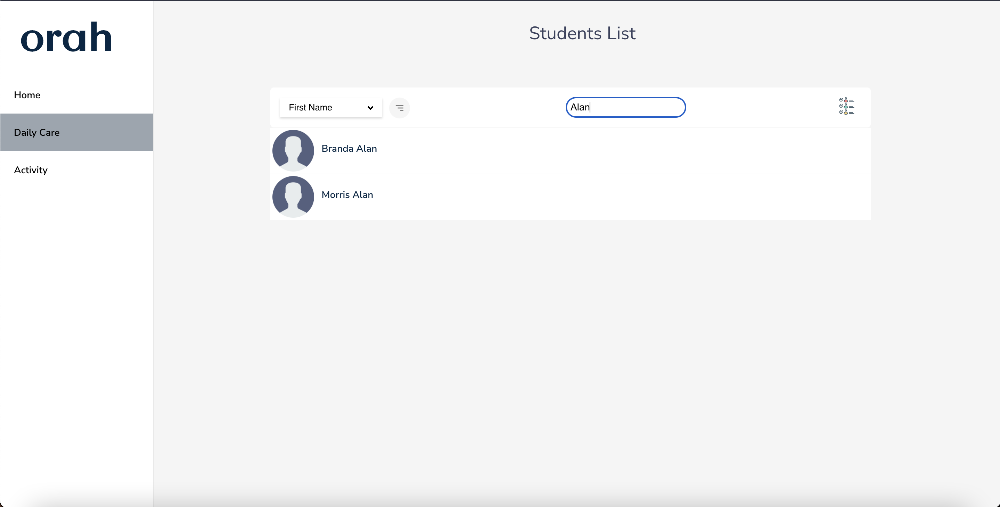
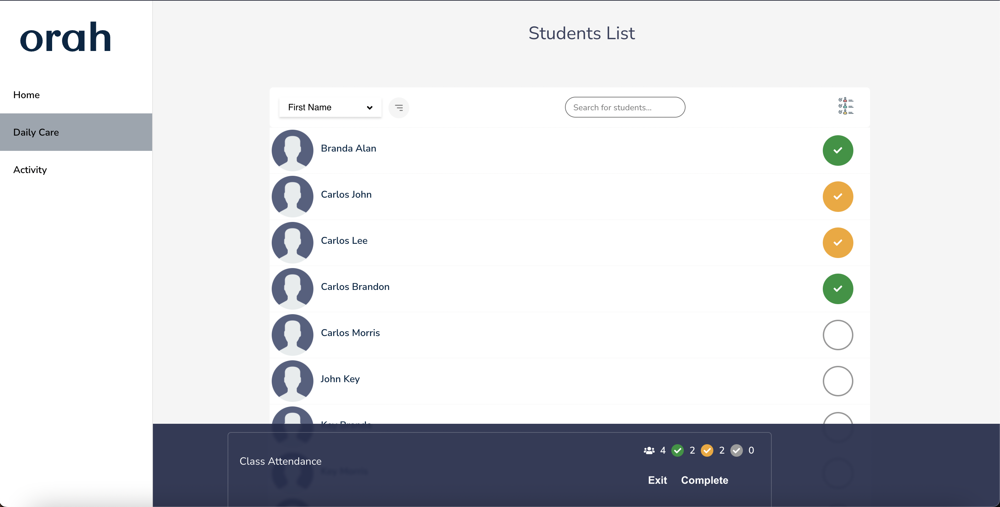
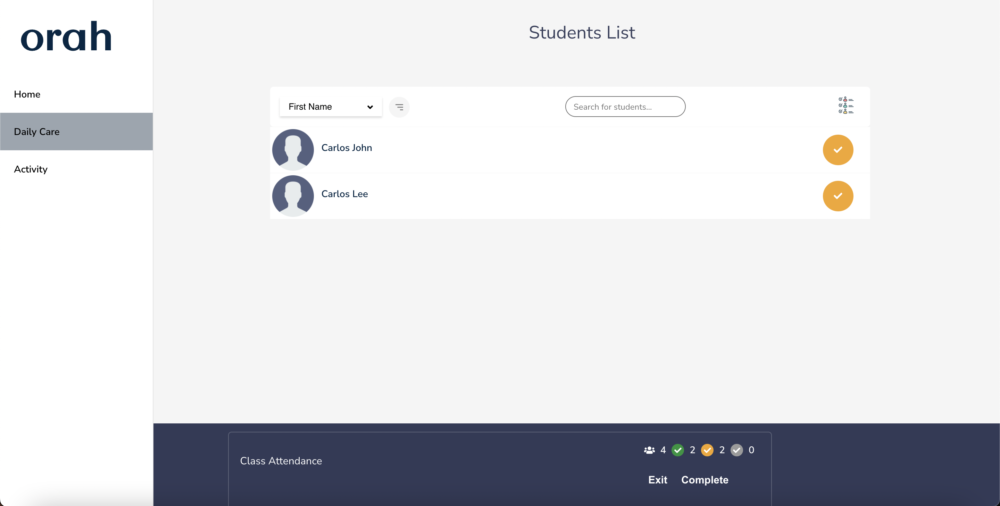
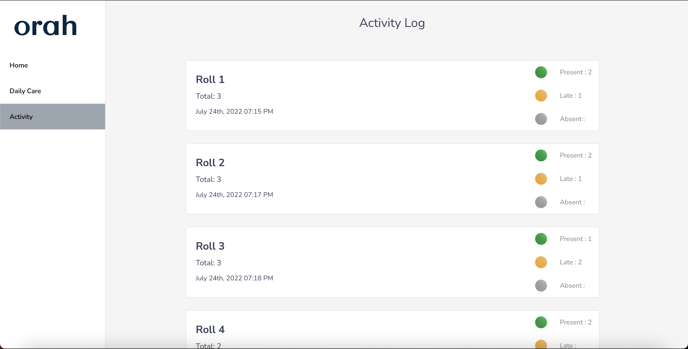

# Technologies Used
- React 
- Typscript 
- Styled Components 
- React Context (State management)
- Moment.js

# Features Implemented 
- [x] Implemented search and sort of students
- Branch [implement-search-and-sort-of-students](https://github.com/manchandajayant/orah-engineering-test/tree/implement-search-and-sort-of-students)

- [x] Displaying a roll summary
- Branch [displaying-a-roll-summary](https://github.com/manchandajayant/orah-engineering-test/tree/displaying-a-roll-summary)

- [x] Filter students based on roll state
- Branch [filter-students-based-on-roll-state](https://github.com/manchandajayant/orah-engineering-test/tree/filter-students-based-on-roll-state)

- [x] (BONUS) Save the current roll and display it in activity page
- Branch [Save-the-current-roll-and-display-it-in-activity-page](https://github.com/manchandajayant/orah-engineering-test/tree/Save-the-current-roll-and-display-it-in-activity-page)

# Extras Implemented 
- Not found page for a 404 route 
- Error handling messages for activities not loading, student list not loading, request to create a roll
- Redirection after roll creation
- Popup to show a request for roll creation 
- UI for landing page
- Mobile responsive styling

# Other cases 
- Search Query with a space does not work.
- Mobile Sidebar collapse button.
- A page for when internet is not working.
- A popup for when user has not completed any rolls and they press complete.

# Code improvements 
- Correct data types to be implemented for student rolls (using any now).
- General refactor of functions and splitting of some more components.
- Define different action types for situations where no payload is required.

# Prodcution branch
- main

# Staging branch 
- solution 

# Other branches (ui and bug fixes)
- ui-activity-page
- reset-state
- fixing-type-bugs
- any-last-UI-or-function-change
- remove-all-any-type